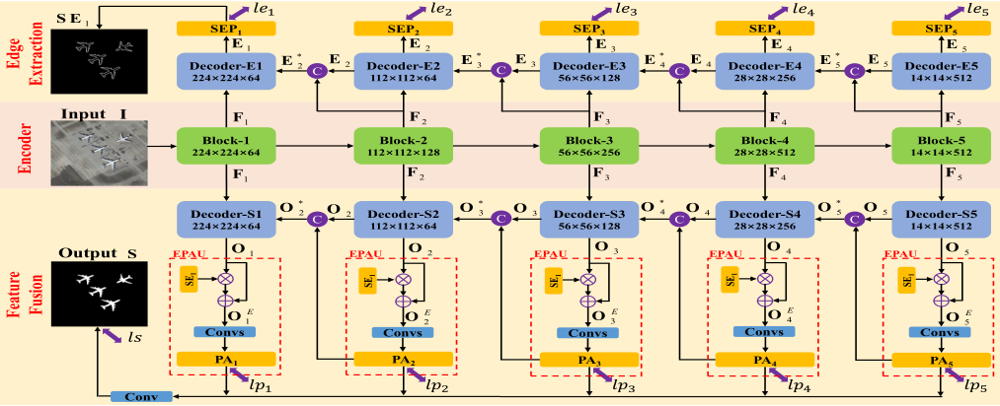
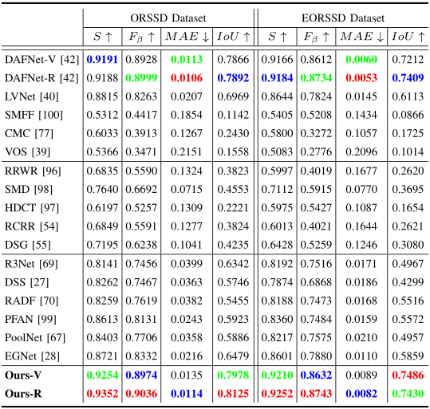
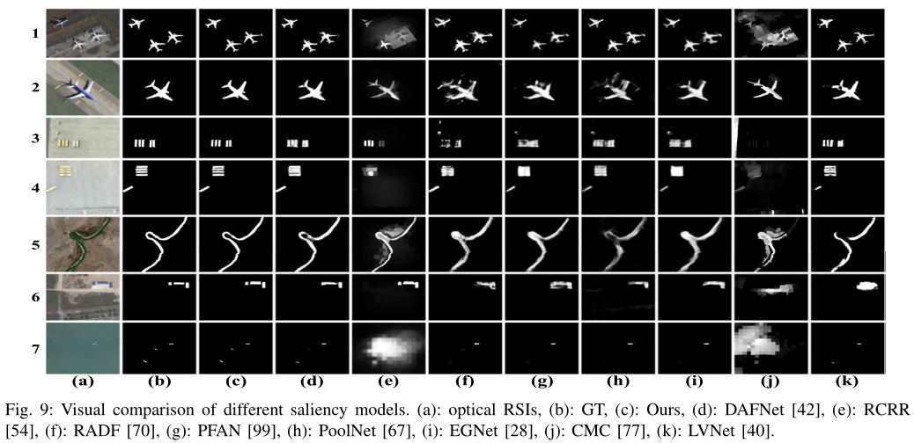

# ERPNet (TCYB 2022)
Xiaofei Zhou, Kunye Shen, Li Weng, Runmin Cong, Bolun Zheng, Jiyong Zhang, and Chenggang Yan, Edge-guided Recurrent Positioning Network for Salient Object Detection in Optical Remote Sensing Images, IEEE Transactions on Cybernetics, 2022, doi: 10.1109/TCYB.2022.3163152.

## Required libraries

Python 3.7  
numpy 1.18.1  
scikit-image 0.16.2  
PyTorch 1.4.0  
torchvision 0.5.0  
glob

## Usage
1. Clone this repo
```
https://github.com/Kunye-Shen/ERPNet.git
```
2. We also provide the predicted saliency maps ([GoogleDrive](https://drive.google.com/drive/folders/1KV0DOnu_u6GlRT8qRfYc5ZC46RR5RQbI?usp=sharing) or [baidu](https://pan.baidu.com/s/1l3idpr-RGFz6KIVqBHKsHQ) extraction code: 8z2p.). You can download directly through the above methods, or contact us through the following email.
```
zxforchid@outlook.com
```

## Architecture


## Quantitative Comparison


## Qualitative Comparison

